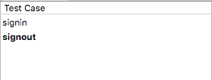

# 測試相關的專有名詞

### 測試案例 (Test Case) vs 測試集合 （Test Suit)

### 測試步驟 (Test Step)

### 測試程序 (Test Run)

### 練習題

* 新增一個測試案例 (Test Case)
  * 工具列的 `New Test Case`
  * 工具列的 `Properties`，修改 `title`
* 匯出 / 匯出 測試案例