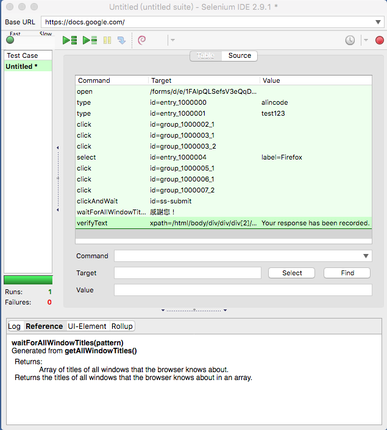

# Selenium IDE 解說

### 重要觀念

* 命令 (Command)：針對選取的元素做出一些行為
* 目標 (Target)：選取元素
  * css 選擇器
  * xpath
* 值 (Value)

### HTML 原始碼

```html
<input class="gsfi" id="lst-ib" maxlength="2048" name="q" autocomplete="off" title="搜尋" value="" aria-label="搜尋" aria-haspopup="false" role="combobox" aria-autocomplete="both" dir="ltr" spellcheck="false" type="text">
```

```html
<input value="Google 搜尋" aria-label="Google 搜尋" name="btnK" jsaction="sf.chk" type="submit">
```

<!-- 開啟 Firebug 解說 -->

### 基本 UI 功能

* 新增第一個命令並執行
  * 用 xpath
  * 用 css 選取器
* 快速 / 慢速執行
* 新增一個測試案例 (Test Case)
  * 工具列的 `New Test Case`
  * 工具列的 `Properties`，修改 `title`
* 匯出 / 匯出 測試案例

### 常用命令

可供測試的網站：<http://bit.ly/watir-example>

**open**

前往某個頁面

命令 (Command) | 目標 (Target) | 值 (Value)
---------|----------|---------
 open    | /test    | 
 open    | http://www.google.com.tw/test | 

**verifyAllWindowTitles**

* 驗證視窗標題

命令 (Command)  | 目標 (Target) | 值 (Value)
------------------------|------------------|---------
 verifyAllWindowTitles  | Google | 

**verifyText**

* 驗證文字

命令 (Command)  | 目標 (Target) | 值 (Value)
---------------|------------------|---------
 verifyText    | xpath=/html/body/div/div/div[2]/div[1]/p | 驗證的文字

 <!-- 一個小練習 -->

**click**

模擬點擊一下

命令 (Command) | 目標 (Target) | 值 (Value)
--------------|----------|---------
 click        | myCheckbox | 
 clickAndWait | mySubmitButton | 
 clickAndWait | myLike | 

**type**

模擬鍵盤輸入

命令 (Command) | 目標 (Target) | 值 (Value)
--------------|----------|---------
 type         | myField | Hi
 typeAndWait  | myField | Hi

<!-- 一個小練習 -->

**pause**

* 暫停
* 單位是毫秒

命令 (Command) | 目標 (Target) | 值 (Value)
--------------|----------|---------
 pause | 5000 | 

**waitForAllWindowTitle**

* 等待視窗指定標題出現

命令 (Command)  | 目標 (Target) | 值 (Value)
------------------------|------------------|---------
 waitForAllWindowTitle  | 您的標題 | 

**select**

模擬選取

命令 (Command)  | 目標 (Target) | 值 (Value)
---------------|------------------|---------
 select        | id=entry_1000004 | label=Firefox
 select        | dropDown         | index=0
 select        | dropDown         | value=AUD
 selectAndWait | dropDown         | index=0
 selectAndWait | dropDown         | value=AUD

### 錄製一個自動填寫表單的程式

<http://bit.ly/watir-example>



* 中斷點的使用
* 匯出測試程式原始碼

### 新增一個完整的測試程式

<http://keystonejs.com/>

### 進階功能

* 擴充命令

### 延伸閱讀

* [Selenium IDE :: Firefox 附加元件](https://addons.mozilla.org/zh-TW/firefox/addon/selenium-ide/)
* [Selenium-IDE — Selenium Documentation](http://docs.seleniumhq.org/docs/02_selenium_ide.jsp)
